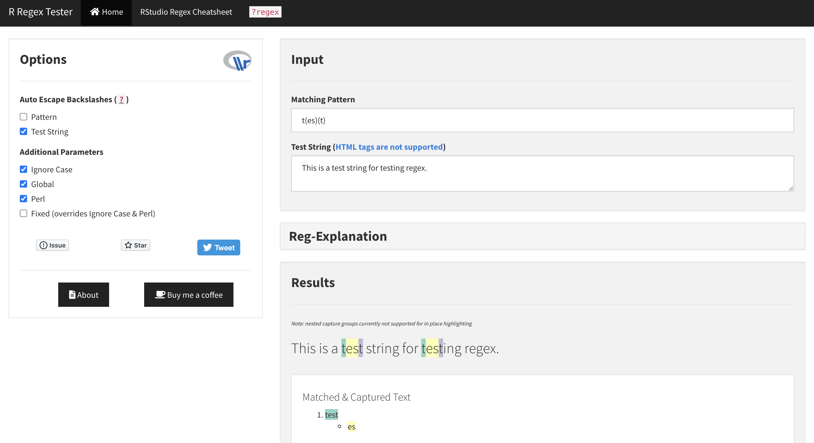

<!-- README.md is generated from README.Rmd. Please edit that file -->

```{r, include = FALSE}
knitr::opts_chunk$set(
  collapse = TRUE,
  comment = "#>",
  fig.path = "man/figures/README-",
  out.width = "100%"
)
```

# R Regex Tester Shiny Application

<!-- badges: start -->
[](https://www.tidyverse.org/lifecycle/#maturing)
<!-- badges: end -->

# R Regex Tester Shiny App 

### Usage

   * __Online__: visit the application live on [shinyapps.io](https://spannbaueradam.shinyapps.io/r_regex_tester/).
   * __Local__:  clone this repo and run the shiny app located in the 'r_regex_tester' directory using R Studio.
   
### Features
   * For a complete write-up of features please see [this blog post](https://adamspannbauer.github.io/2018/01/16/r-regex-tester-shiny-app/)

<p align="center">
  <kbd>
    
  </kbd>
</p>

## Installation

The development version from [GitHub](https://github.com/) with:

``` r
# install.packages("devtools")
devtools::install_github("AdamSpannbauer/r_regex_tester_app")
```

# Code of Conduct 

Please note that the 'r_regex_tester_app' project is released with a
[Contributor Code of Conduct](CODE_OF_CONDUCT.md).
By contributing to this project, you agree to abide by its terms.