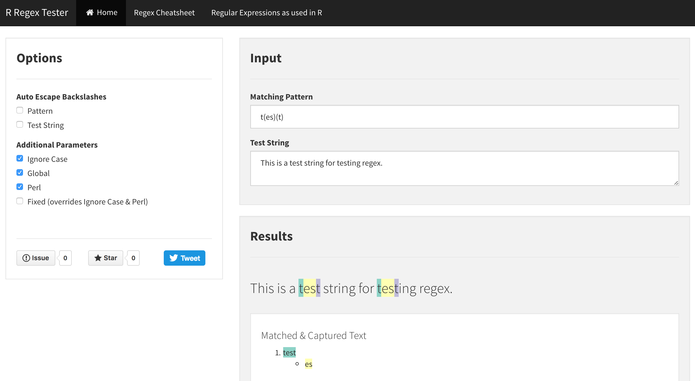

# R Regex Tester Shiny Application

### Usage:

   * Online: visit the application live on [shinyapps.io](https://spannbaueradam.shinyapps.io/r_regex_tester/).
   * Local:  clone this repo and run the shiny app located in the 'r_regex_tester' directory using R Studio.
   
### Features:
   * Test regular expressions in an R environment
      * highlight matches & captures in test string
      * display list of matches & captures
   * Option to escape backslashes manually
      * avoid having to double-up on backslashes if copy/pasting regex from another tester

